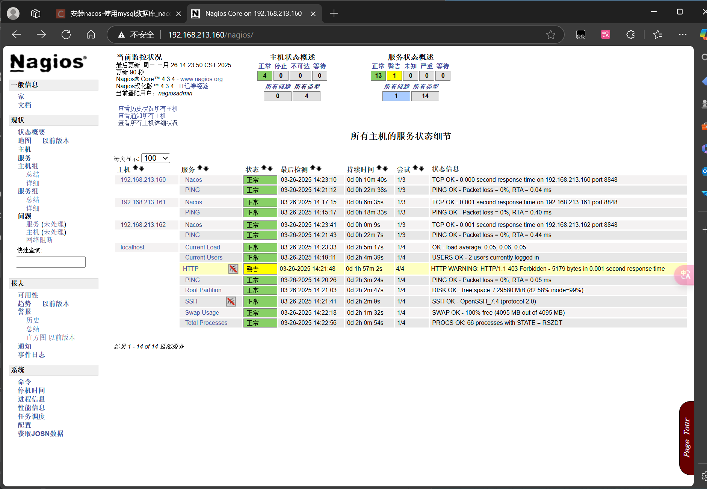

haring Platform Deployment)

## 项目概述
在重庆远智科技实习期间，我部署了一个内部文件共享平台，支持员工文件上传、下载及多部门协作，目标是提供高效、稳定的文件访问服务。

## 技术栈
- **操作系统**: CentOS 7  
- **虚拟化**: VMware Workstation Pro  
- **容器化**: Docker  
- **Web服务**: Nginx  
- **存储**: MinIO  
- **脚本**: Shell  
- **监控**: Nagios  

## 实现过程
- 在VMware中创建CentOS 7虚拟机，初始化Git仓库（`git init`）。
- 使用`docker pull minio/minio`拉取镜像，`docker run -p 9000:9000`启动MinIO，配置存储桶和访问权限。
- 配置Nginx反向代理（`upstream`和`proxy_pass`），启用gzip压缩和缓存，优化并发性能。
- 编写Shell脚本（`mc cp`同步，`tar -czvf`打包），通过`crontab`实现每日备份。
- 部署Nagios监控CPU、磁盘（`check_cpu`、`check_disk`），设置邮件告警。
- 调整Nginx `worker_processes`至4，提升高峰期响应速度。

## 挑战与解决
- **上传失败**: 通过`docker logs`排查，发现权限配置错误，调整AccessKey后解决。
- **性能瓶颈**: 高并发时响应慢，启用Nginx缓存，优化至150ms。

## 成果
- 支持30+员工并发访问，响应时间<150ms。
- 系统连续运行3个月无宕机，每日备份稳定执行。

## 代码亮点
- 包含Dockerfile和Nginx配置文件示例。
- Shell备份脚本可供参考。

## 运行环境截图

